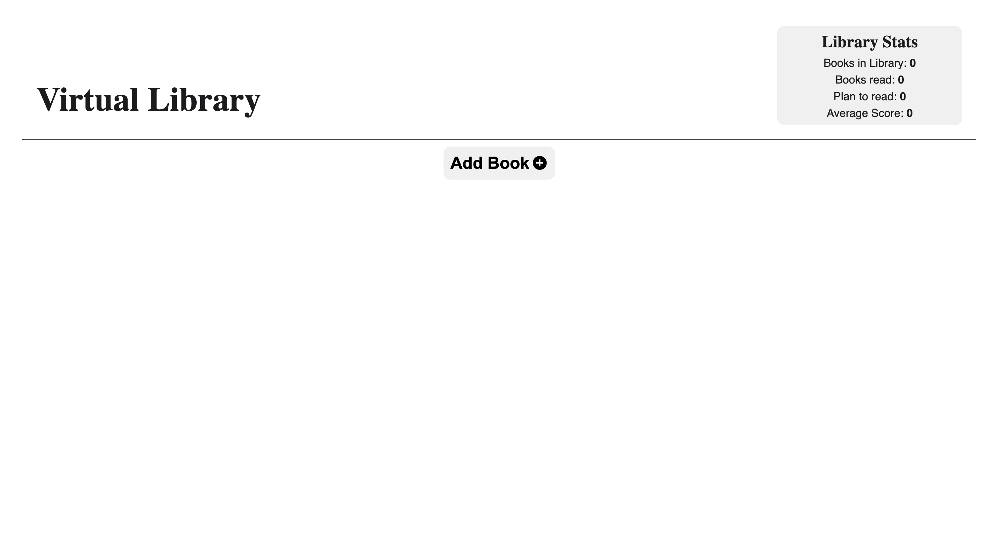
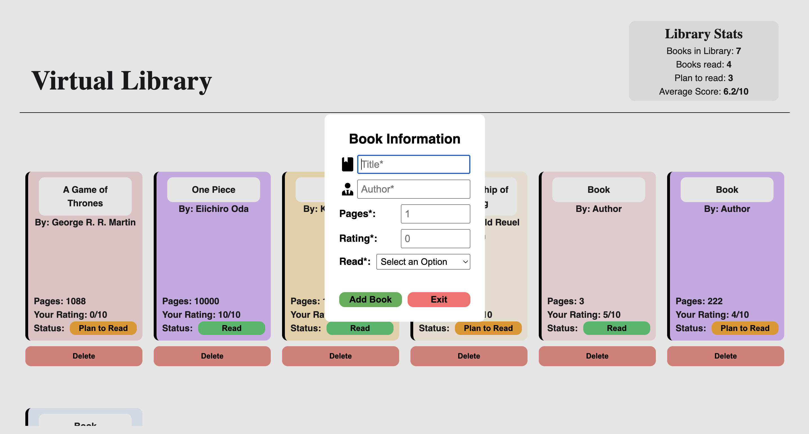

# Virtual Library
Home Library app made with Js, HTML/CSS.

This program helped me get very familiar with Javascript objects and improved my ability to manipulate HTML/CSS with Javascript.

## Features

- Responsive layout using CSS Grid and Flexbox
- Library stats that update live
- Add Books to your library
- Remove books from your Library
- Rate your favourites!
- Toggle between Read and Plan to Read
- Clean UI

[Live Demo](https://raihancarder.github.io/virtual-home-library/)

## Screenshot

## Installation

1. Clone the repo  
   `git clone https://github.com/raihanCarder/virtual-home-library.git`

2. Navigate to the folder  
   `cd virtual-home-library`

3. Open `index.html` in your browser (or run with Live Server)

## Tech Stack
- Javascript
- HTML
- CSS

Created by Raihan Carder(https://github.com/raihanCarder)  
Feel free to reach out!

